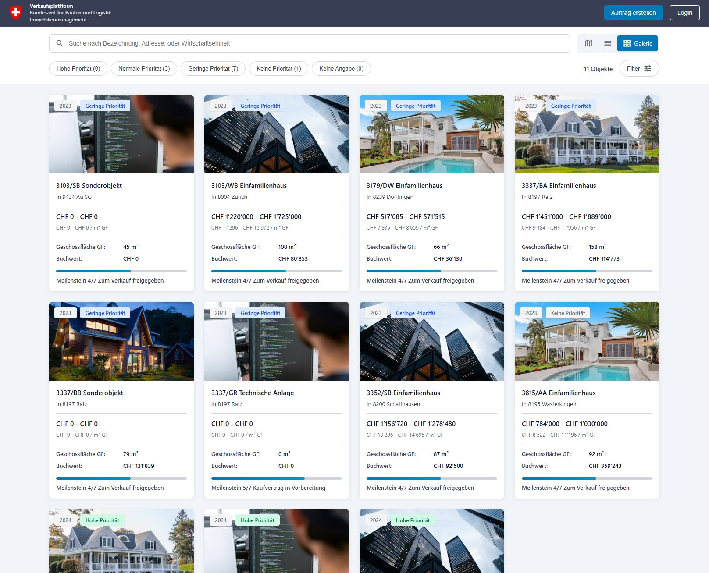
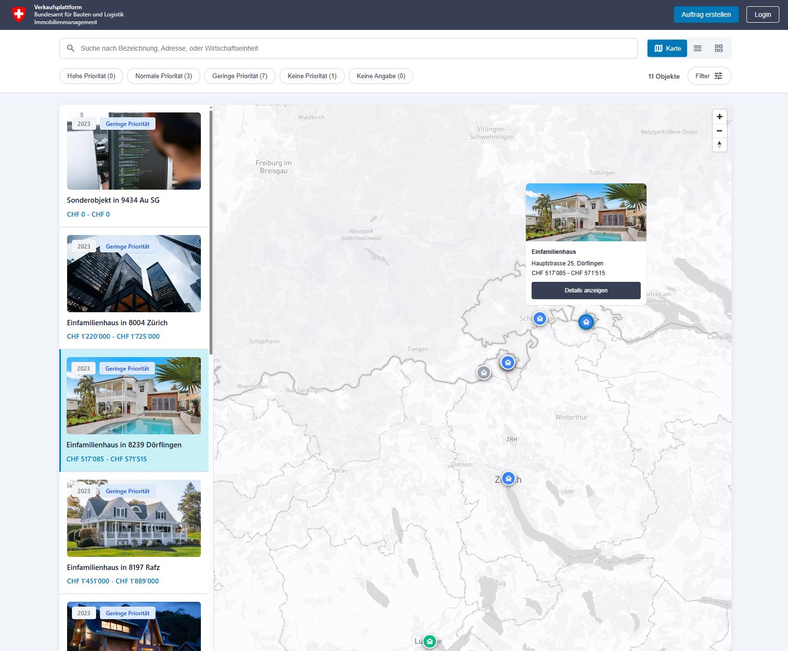

# Transaction Immo

<p align="center">
  
</p>

[](https://bbl-dres.github.io/transaction-portal/)
[](LICENSE)

> [!CAUTION]
> This is an unofficial mockup for demonstration purposes only. All records are fictional, not every function is implemented, and it is not intended for production use.

A browser-based prototype for exploring and managing federal properties offered for sale across Switzerland.

## Demo

**Live demo:** https://bbl-dres.github.io/transaction-portal/

<p align="center">
  
  
</p>

## Features

- Compare properties in gallery, sortable list, and interactive map views.
- Search titles and addresses in real time.
- Filter by priority, canton, property type, year, condition, and other criteria.
- Review specifications, pricing, location ratings, milestones, and documents.
- Share filtered views through URL parameters.
- Use the responsive interface on desktop, tablet, or mobile.
- Explore the static demo without an account or backend service.

## Run locally

The app loads its static JSON data over HTTP:

```bash
python -m http.server 8000
```

Then open <http://localhost:8000/>.

## License

Licensed under the [MIT License](LICENSE).

Third-party libraries and assets retain their respective upstream terms.
