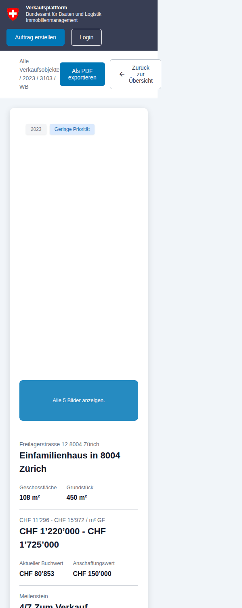
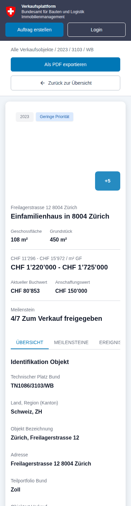
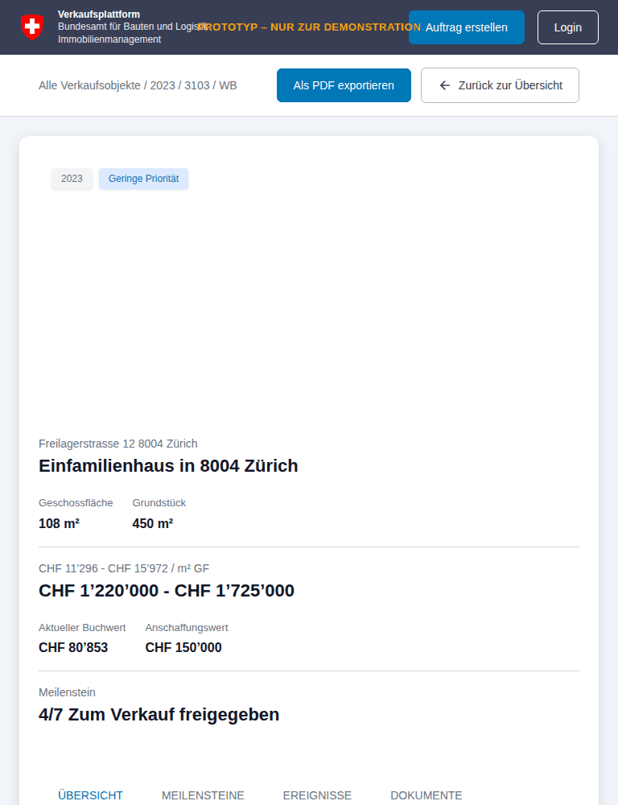
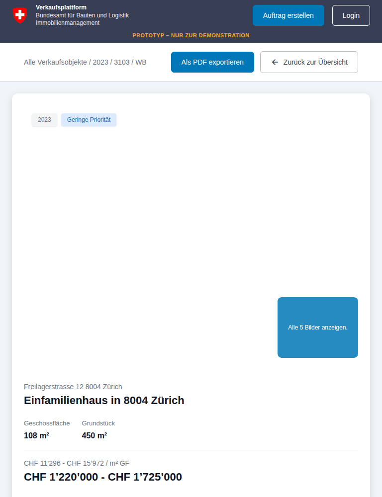
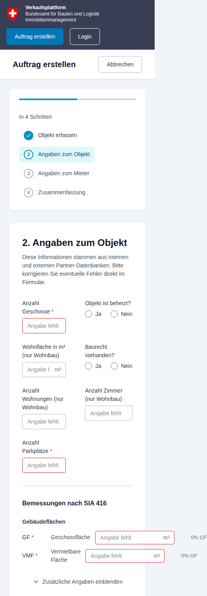
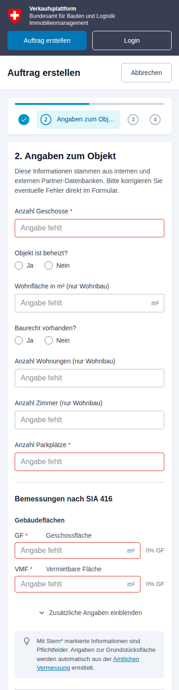
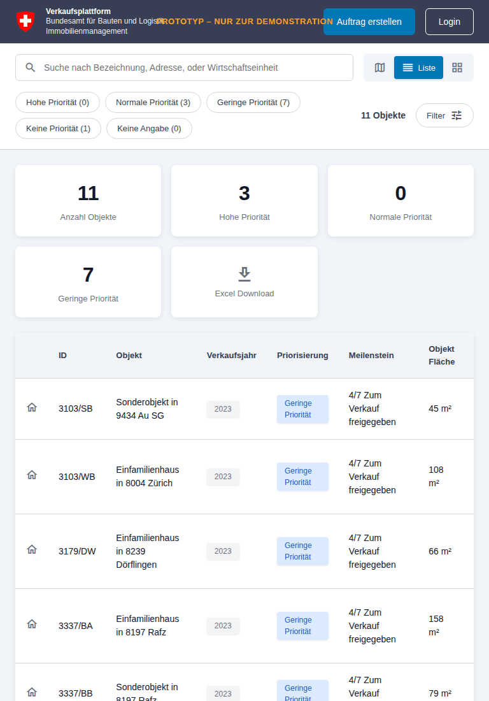
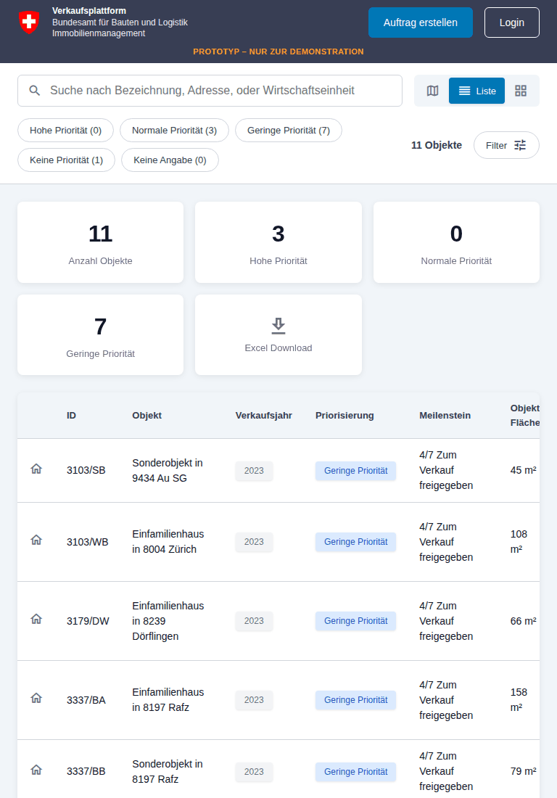
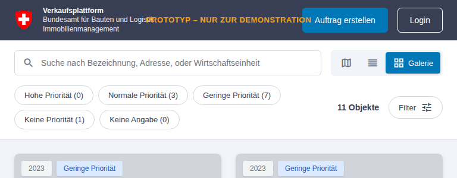
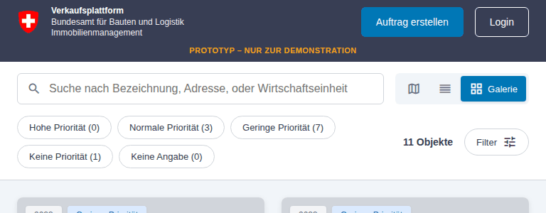

# Design review: responsive layout and mobile support

**Scope:** the complete prototype (gallery, list, map, filter dialog, login, property detail with all four tabs, image carousel, upload dialog, the four-step "Auftrag erstellen" wizard, API documentation) at seven viewport sizes from a 360 px phone to a 1920 px desktop.

**Method:** every view was rendered headlessly in Chromium with Playwright (`tools/responsive-audit.js`) at 360×740, 390×844, 768×1024, 1024×768, 1280×800, 1440×900 and 1920×1080. For each state the script measured horizontal page overflow, elements extending beyond the viewport, interactive elements smaller than 32 px and produced full-page screenshots, which were then reviewed manually. External images and map tiles were blocked in the sandbox, so screenshots show grey placeholders where photos and the base map would be.

**Verdict:** desktop and large-laptop layouts (≥1280 px) are solid and the visual system (tokens, cards, tags) is consistent. Below 1024 px the prototype had a number of layout breakages that made three areas hard or impossible to use on a phone: the property detail page, the list view's table, and step 2 of the wizard. All of them are fixed in this branch; the remaining recommendations are listed at the end.

---

## 1. Findings

Severity: **S1** blocks a task on that device · **S2** clearly degraded, workaround exists · **S3** polish / consistency.

### Global shell

| # | Sev | Where | Finding | Root cause | Fix |
|---|-----|-------|---------|------------|-----|
| G1 | S2 | Header + footer, 641–1000 px (tablets, small laptop windows) | The "PROTOTYP – NUR ZUR DEMONSTRATION" banner is absolutely centred and overlaps the header title and the "Auftrag erstellen" button. | `position:absolute; left:50%` ignores its siblings. | ≤1024 px the banner becomes a normal full-width line under the header row; in the footer it wraps the same way ≤768 px. ≤640 px it is shown in the footer only. |
| G2 | S2 | Header, ≤640 px | Two header buttons wrap awkwardly and the prototype banner was simply hidden on phones. | Fixed `height:68px`, no wrapping strategy. | Header uses `min-height` and wraps; the two buttons share a full-width row with equal widths. |
| G3 | S2 | All text inputs, iPhone | Inputs use 14 px text, which makes iOS Safari zoom the page on focus and leaves it zoomed. | Font size below 16 px on form controls. | All inputs/selects/textareas use 16 px ≤768 px. |
| G4 | S2 | Login and upload dialogs, ≤400 px | Dialog touches both screen edges (no margin) and could exceed the viewport height in landscape. | Overlay had no padding, dialog no max-height. | 16 px overlay padding, `max-height: 100dvh − 32px` with internal scrolling. |
| G5 | S2 | Filter chips row, ≤640 px | The five priority chips stack into three rows and push content down ~110 px before any results appear. | `flex-wrap`. | Chips scroll horizontally in one row on phones (edge-to-edge, hidden scrollbar). |
| G6 | S3 | Search field, ≤640 px | Placeholder "Suche nach Bezeichnung, Adresse, oder Wirtschaftseinheit" is truncated mid-word. | Placeholder too long for ~270 px. | Short placeholder swapped in via `matchMedia` on phones. |
| G7 | S3 | View toggle, ≤640 px | The toggle stretches to full width but its three buttons stay left-aligned, leaving an empty grey bar. | Buttons not flexed. | Buttons share the width equally. |
| G8 | S3 | Footer links | 20 px tall tap targets. | No padding. | 36 px hit area via padding with compensating negative margin (footer height unchanged). |
| G9 | S3 | Header logo link | `href="/"` leaves the app when hosted under a sub-path (GitHub Pages demo). | Absolute root link. | `href="./"`. |
| G10 | S2 | Whole app, restricted networks | If Google Fonts is unreachable, every icon renders as its ligature text ("precision_manufacturing", "arrow_back" …) and blows the layout apart; if unpkg.com is unreachable, `maplibregl is not defined` throws inside the render pipeline and **the object count and filters stop updating in every view**. Both happened in the review sandbox. | Hard dependency on two third-party CDNs without fallbacks. | Map: guard renders a "Karte konnte nicht geladen werden" notice instead of throwing. Icons: `document.fonts.load()` check adds `no-icon-font` to `<html>`, CSS then hides the ligature words. Self-hosting is still recommended (see §4). |
| G11 | S3 | Touch devices | Map markers 30 px, chips/buttons ~35 px, detail/login links 20 px. | — | `(pointer: coarse), (max-width: 768px)` rule: markers 36 px, chips/filter/view buttons ≥40 px, links ≥36 px. |
| G12 | S3 | Motion | Hover lift on cards and tag scaling also fire on touch (sticky hover) and ignore `prefers-reduced-motion`. | — | Hover transform only under `@media (hover: hover)`; reduced-motion disables transitions. |

### Gallery view

| # | Sev | Where | Finding | Fix |
|---|-----|-------|---------|-----|
| GA1 | S3 | 601–640 px | Two breakpoints for the same thing (grid at 600 px, everything else at 640 px). | Unified at 640 px; all grids use `minmax(0, 1fr)` so long content can never widen a column beyond the viewport. |
| GA2 | S3 | 1024 / 1280 px | 3 and 4 columns of ~290–300 px cards work well; no change. | — |

### List view

| # | Sev | Where | Finding | Root cause | Fix |
|---|-----|-------|---------|------------|-----|
| L1 | **S1** | ≤900 px | The table is clipped, not scrolled: at 768 px the "Marktwert" column is invisible, at 390 px everything right of "Objekt" is gone. Users cannot reach the data. | `.list-table-container { overflow: hidden }`. | Container scrolls horizontally; table has a sensible `min-width`; decorative icon column hidden ≤640 px. |
| L2 | S2 | ≤640 px | Five KPI boxes in a 3-column grid overflow the viewport at 360 px and squeeze the numbers. | `repeat(3, 1fr)` with no phone rule. | 2-column grid on phones, the "Excel Download" box spans the full width as a horizontal button. |
| L3 | S3 | 768 px | Priority tags wrap onto two lines inside the pill. | — | `white-space: nowrap` on tags. |

### Map view

| # | Sev | Where | Finding | Root cause | Fix |
|---|-----|-------|---------|------------|-----|
| M1 | S2 | ≤768 px | Result list above the map is a 250 px tall scroll area showing ~1.3 cards, the map sits below the fold. | Column stack with fixed heights. | Map first (`min(60vh, 480px)`), results as a horizontally swipeable, snap-scrolling card strip underneath (bottom-sheet pattern). Selecting a marker scrolls the matching card into view (also on desktop). |
| M2 | S2 | any | Missing map library breaks filtering app-wide (see G10). | — | Guarded. |

### Property detail page

| # | Sev | Where | Finding | Root cause | Fix |
|---|-----|-------|---------|------------|-----|
| D1 | **S1** | ≤640 px | Page is 209–239 px wider than the phone screen: breadcrumb, "Als PDF exportieren" and "Zurück zur Übersicht" are forced onto one line and the back button is cut off. Because the page overflows, the fixed carousel overlay is also wider than the screen and its close button is unreachable. | Header row cannot wrap; tabs cannot wrap or scroll. | Header actions wrap and span the full width on phones; tabs scroll horizontally. |
| D2 | **S1** | 641–900 px | Two of the four thumbnails (including the "Alle 5 Bilder anzeigen" tile that opens the carousel) render with **0 px height** and are invisible. | Gallery is a fixed-height 2-row grid; with the main image spanning both columns the last two thumbs land in an implicit auto row with no content. | ≤900 px: hero image (16:9) on top, all four thumbnails in one row below with a fixed aspect ratio. On phones the tile shows "+5" instead of the sentence. |
| D3 | S2 | ≤640 px | Previous phone layout stacked the hero and four 100 px thumbnails vertically (~650 px of images before any text). | — | See D2. |
| D4 | **S1** | ≤640 px, Ereignisse/Dokumente tabs | Tables and their toolbars (search + three action buttons) overflow by up to 435 px. | No wrapping, no scroll container. | Toolbar wraps; tables are wrapped in a `.table-scroll` container. |
| D5 | S2 | ≤768 px | Two invisible "spacer" data items (used to align the two-column grid) leave blank rows in the single-column layout. | Placeholder items rendered unconditionally. | Marked with `.detail-data-item-spacer`, hidden when the grid is single column. |
| D6 | S3 | ≤768 px | Location ratings (label / value / bar) stack into three rows each. | 1-column override. | Label and value share one line, bar underneath. |
| D7 | S3 | ≤640 px | Milestone rows: button squeezed beside the text. | — | Button moves below the text, full width. |
| D8 | S3 | ≤640 px | 24 px card padding plus 24 px page margin left only 294 px of content width on a 390 px phone. | Fixed spacing. | Gutter and panel-padding tokens shrink to 16 px on phones (326 px content width). |
| D9 | S3 | 1024 px | Title / price / milestone row becomes one column already at 1100 px; on a 1024 px tablet that is a lot of stacking but remains readable. Left as is. | — | — |

### Carousel

| # | Sev | Finding | Fix |
|---|-----|---------|-----|
| C1 | S3 | Thumbnail strip is `justify-content: center` inside a scroll container: once it overflows, the first thumbnails become unreachable. | Left-aligned with auto margins (centred while it fits, scrollable when it does not). |
| C2 | S3 | Image height uses `100vh`, which is wrong under mobile browser chrome. | `100dvh` with `vh` fallback. |

### "Auftrag erstellen" wizard

| # | Sev | Where | Finding | Root cause | Fix |
|---|-----|-------|---------|------------|-----|
| W1 | **S1** | Step 2, ≤768 px | Fields stay in two columns; on a 390 px phone each input is ~70 px wide and the placeholder reads "Angabe f". | The phone rule targeted `.sales-form-input-grid` but the two-column variant `.sales-form-input-grid.two-column` has higher specificity and kept `1fr 1fr`. | Explicit single-column rule for `.two-column`. |
| W2 | **S1** | Step 2, ≤768 px | SIA 416 rows (GF, VMF …) overflow the screen by 130–160 px; input and percentage are off-screen. | The rows use `.sia-416-row` (`60px 1fr 200px 70px`) but the only responsive rule in the stylesheet targeted `.sales-form-areas-row`, a class that no longer exists in the markup. | Dead CSS removed; `.sia-416-row` becomes a two-line grid (abbreviation + name, then input + percentage). |
| W3 | S2 | Step 2, ≤640 px | Condition/standard rating scale: five 40 px icons and labels in ~55 px columns. | Desktop sizing. | Smaller icons and labels on phones; track line re-aligned. |
| W4 | S2 | Sidebar, ≤1100 px | The intended horizontal stepper collapsed back into a vertical list that costs ~200 px above the form on phones. | Flex-basis of the step list. | Progress bar + horizontal stepper; on phones only the active step shows its label ("2 Angaben zum Objekt"), the others show their number. |
| W5 | S2 | Navigation, ≤640 px | "Zurück" and "Weiter" are right-aligned; with two buttons the row could push the back button off the left edge. | `justify-content: flex-end` with no wrap. | Wraps; on phones back is left, next is right (standard wizard pattern). |
| W6 | S3 | Summary step | "Bearbeiten" buttons are 18 px tall. | — | 34 px hit area. |
| W7 | S3 | All steps, ≤640 px | 32 px content padding plus 24 px page padding. | — | 16 px on phones, 20 px on tablets. |
| W8 | S3 | Layout | `.sales-form-view { min-height: 100vh }` forces the footer below the fold on every step and misbehaves with mobile browser chrome. | — | Removed (the flex column already fills the page). |
| W9 | S3 | Any width | The content column had no `min-width: 0`, so any wide child (a long word, a table) widened the whole page instead of wrapping. | Flex default `min-width: auto`. | `min-width: 0`. |

### API documentation

| # | Sev | Finding | Fix |
|---|-----|---------|-----|
| A1 | S2 | Endpoint rows: description clipped at the right edge on phones, long paths cannot wrap. | Header wraps, description drops to its own line ≤640 px, paths use `overflow-wrap: anywhere`; parameter tables scroll inside the endpoint body. |

### Print ("Als PDF exportieren")

| # | Sev | Finding | Fix |
|---|-----|---------|-----|
| P1 | S2 | The button calls `window.print()` but there was no print stylesheet: the dark header/footer, search bar, buttons and only the active tab were printed. | Print rules hide the chrome, print all four tab sections (each starting on a new page), drop the image gallery and the map iframe, avoid page breaks inside data items and table rows. |

### Accessibility notes found on the way

- Icon-only buttons (search clear, filter reset/close, carousel navigation, photo remove, location clear) had no accessible name: `aria-label`s added.
- Table checkboxes are 18 px; the whole checkbox cell now toggles them, and the tab search input fills its 38 px box.
- The search input had no label: `aria-label="Suche"` added.
- `theme-color` meta added so the mobile browser chrome matches the header.

---

## 2. What changed (by file)

- `css/tokens.css` – new layout tokens `--page-max-width`, `--page-gutter` (24 px → 16 px on phones) and `--panel-padding`.
- `css/styles.css`
  - base rules: header wraps, buttons never break mid-label, tags `nowrap`, list table scrolls instead of clipping, tabs scroll, toolbar and actions wrap, dialogs get margins and max-height, carousel thumbs safe-centred, wizard content `min-width: 0`, 34 px "Bearbeiten" target, footer link hit area;
  - all `repeat(n, 1fr)` grids changed to `minmax(0, 1fr)`;
  - the scattered `@media` blocks were rewritten in place (filter modal, list/map, detail gallery, detail object/location, wizard) and a consolidated shell section was added at the end with the breakpoint scale documented in a comment;
  - dead `.sales-form-areas-*` block removed;
  - new: `pointer: coarse`, `prefers-reduced-motion`, `.no-icon-font` fallback and `@media print`.
- `index.html` – `theme-color`, relative home link, short-placeholder data attribute, `aria-label`s.
- `js/main.js` – MapLibre guard, sidebar `scrollIntoView` on selection, gallery tile short label, spacer class, `.table-scroll` wrappers, phone placeholder, icon-font detection, `aria-label`s on generated buttons.
- `tools/responsive-audit.js` – the audit script used for this review (see header comment for usage).

No data, routing or business logic was changed.

---

## 3. Verification

The same audit was run before and after the changes. "Overflow" is how many pixels the page was wider than the viewport.

| View | Viewport | Overflow before | Overflow after |
|---|---|---|---|
| api | phone-360 | 1 px | 0 px |
| carousel | phone-360 | 239 px | 0 px |
| carousel | phone-390 | 209 px | 0 px |
| detail | phone-360 | 239 px | 0 px |
| detail | phone-390 | 209 px | 0 px |
| detail-docs | phone-360 | 407 px | 0 px |
| detail-docs | phone-390 | 377 px | 0 px |
| detail-events | phone-360 | 297 px | 0 px |
| detail-events | phone-390 | 267 px | 0 px |
| detail-milestones | phone-360 | 239 px | 0 px |
| detail-milestones | phone-390 | 209 px | 0 px |
| form-2 | phone-360 | 162 px | 0 px |
| form-2 | phone-390 | 132 px | 0 px |
| upload | phone-360 | 407 px | 0 px |
| upload | phone-390 | 377 px | 0 px |

All other view/viewport combinations had no horizontal overflow in either run.

Manual screenshot review after the fix (390 px): header 2 rows, chips scroll, gallery single column; list KPIs 2×2 + download bar, table scrolls; map first with card strip; detail page fits, hero + 4 thumbs, tabs scroll, tables scroll; wizard steps 1–4 fit with compact stepper; dialogs have margins; API rows wrap.

Things this review could not verify in the sandbox and that should be checked on real devices: actual MapLibre tiles and marker popups on a phone (the library was stubbed), iOS Safari focus/zoom behaviour, the printed PDF from a real browser, and image loading/cropping (photos were blocked).

---

## 4. Recommendations not implemented (next steps)

1. **Self-host the icon font or switch to inline SVG icons.** Two CDNs (Google Fonts, unpkg) are single points of failure and are commonly blocked on government networks. The fallback added here keeps the layout intact, but icon-only buttons then show no glyph. Vendoring the two `.woff2` files (≈280 KB) into `assets/fonts/` or moving to inline SVGs removes the dependency; MapLibre should be vendored the same way.
2. **List view as cards on phones.** A horizontally scrolling 8-column table is usable but not pleasant on a phone; the gallery view already covers this, so consider hiding the "Liste" toggle ≤640 px or rendering the list as compact rows (ID, object, price, priority tag).
3. **Filter dialog as a bottom sheet on phones** with sticky "Anwenden/Zurücksetzen" actions; the current centred dialog works but requires scrolling through five groups.
4. **Sticky detail-page action bar on phones** ("Zurück" / "PDF") so users do not have to scroll back to the top of a very long page.
5. **Responsive images.** Cards request 400×300 placeholders regardless of screen density; use `srcset`/`sizes` (or the image service's width parameter) once real photos exist.
6. **Wizard validation feedback on mobile**: required fields are only signalled by a red border; add inline messages, and consider a sticky "Weiter" button on long steps.
7. **Header on phones**: consider a compact variant (logo + "Verkaufsplattform" only, actions in an overflow menu) to gain ~50 px above the fold.
8. **Safe-area insets** for notched phones in landscape (`viewport-fit=cover` + `env(safe-area-inset-*)` on header, footer and gutters) once the header/footer colours are final.

## 5. Re-running the audit

```bash
python -m http.server 8000
npm i -D playwright && npx playwright install chromium
node tools/responsive-audit.js            # screenshots + metrics.json in ./audit-shots
STUB_MAP=1 node tools/responsive-audit.js # on networks that block unpkg.com
```

The script exits non-zero when any state/viewport combination overflows horizontally, so it can run in CI.

## 6. Screenshot evidence

Cropped before/after captures from the audit (`docs/review-screenshots/`). Photos and map tiles are grey placeholders because external hosts were blocked in the review environment.

| Issue | Before | After |
|---|---|---|
| D1/D2/D4 – detail page on a 390 px phone (page 209 px too wide, gallery stacked, tabs and header cut off) |  |  |
| D2 – detail page on a 768 px tablet (two thumbnails collapsed to 0 px) |  |  |
| W1/W2/W4 – wizard step 2 on a 390 px phone (two-column inputs, SIA rows off-screen, vertical stepper) |  |  |
| L1/L2 – list view on a 768 px tablet (columns clipped, KPI grid) |  |  |
| G1 – header banner overlapping the buttons at 768 px |  |  |
